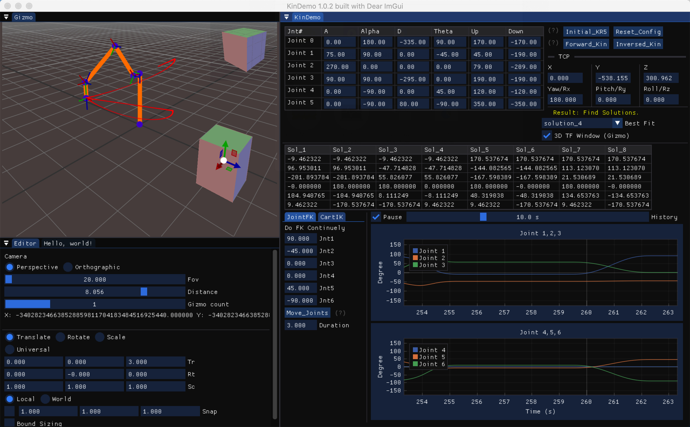

# Demos
This folder will provide examples of using library

## kinDemo_Im:
* A demo GUI based on ImGUI with glfw+opengl3, and compiled with webassembly for [online version](https://robincpc.github.io/demo/)

## kinDemo_qt: 
* A simple GUI, made by Qt, demo how to use API for forward & inverse Kinematics of 6-axis robot arm.

